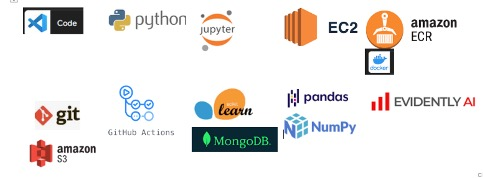
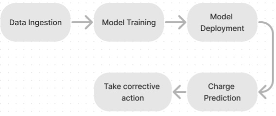
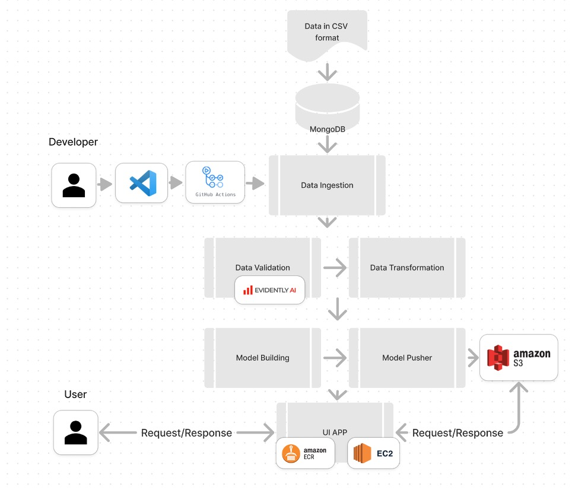
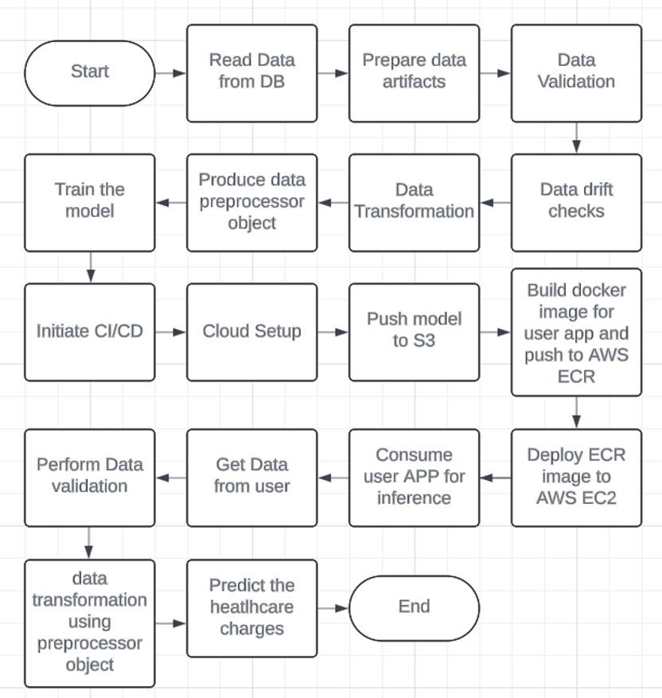
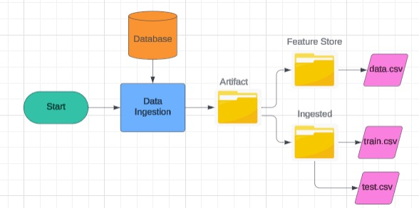
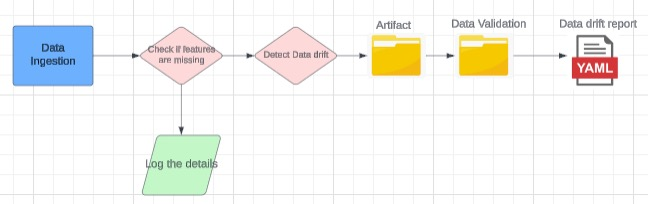
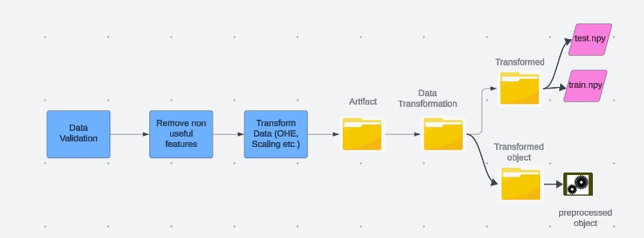

# Insurance Premium Optimization  

Calculation of insurance premium is traditionally a statistical process with certain assumptions based on general population. For example, there is often a single premium rate for all 27-year-old males who are non-smokers. Attributes like **Age, Gender, and Smoking Status** play a key role in premium calculation.  

The aim of this project is to check whether the premium set for a particular insured is justified by **estimating hospitalization charges** based on demographic details and comparing them with the calculated premium. Based on this comparison, adjustments can be made to minimize losses for the company.  

## Prerequisites

Create a virtual environment and install the dependencies from the **requirements.txt** file. An you should also have an AWS account because this is where we are going to deploy the project.

> Note: replace \<venv\> with your environment name

```
conda create -n <venv> python=3.8 -y
conda activate <venv>
pip install -r requirements.txt
```

## Dataset

The dataset can be downloaded from [kaggle](https://www.kaggle.com/datasets/noordeen/insurance-premium-prediction)


## Problem Statement  
Knowing whether the right amount of premium is set for an insured.  

---

## Proposed Solution  
- Estimate the expected payout for an insured using demographic details such as **Age, Gender, BMI, Region, Number of Children, and Smoking status**.  
- Use machine learning methods, particularly regression algorithms like:  
  - Linear Regression  
  - Decision Tree Regressor  
  - Ensemble tree algorithms such as Random Forests and XGBoost  
- Compare the **estimated payout** with the calculated premium to identify potential loss-making policies at the policy issue stage and take corrective action.  


## Tech Stack  
- **IDE**: Visual Studio Code  
- **Programming Languages**: Python, HTML/CSS  
- **Notebook Experimentation**: Jupyter  
- **Version Control**: Git  
- **EDA**: Python, NumPy, Pandas, Matplotlib, Seaborn  
- **Data Drift Detection**: Evidently AI  
- **CI/CD**: GitHub Actions  
- **Containerization**: Docker  
- **Container Registry**: AWS ECR  
- **Application Hosting**: AWS EC2  
- **Model Storage**: AWS S3  
- **Data Persistence**: MongoDB  



## Process Flow  


## High Level Architecture  


## Detailed Architecture  


## Data Pipeline 


### Data Ingestion  
- Reads the data from the database.  
- Converts data to CSV format for model training.  
- Produces three artifacts:  
  - Full dataset  
  - Training set (CSV)  
  - Test set (CSV)  
- All outputs stored under **Artifacts folder**.  



### Data Validation  
- Ensures all required columns are present.  
- Checks for **data drift issues**.  
- Output is a **data drift report (YAML)** under `Artifacts → Data Validation`.  

 

### Data Transformation  
- Drops non-contributing features.  
- Performs preprocessing such as:  
  - One-hot encoding  
  - Ordinal encoding  
  - Scaling and standardization  
- Stores transformed data as NumPy arrays under:  
  - `Artifacts → Data Transformation → Transformed`  
- Preprocessing objects are stored for inference at:  
  - `Artifacts → Data Transformation → Transformed object`  

 

## Logging and Error Handling  

### Event Log  
- Python’s **logging** library is used.  
- Logs are maintained for all pipeline stages under the `logs` folder.  
- Each log is uniquely identified with a **timestamp**.  

### Error Handling  
- Python’s **Exception base class** is used for error handling.  
- All exceptions are captured using `try/except` blocks.  
- Errors propagate back with detailed file name, line number, and error message. 


## Deployment  

### CI/CD  
- The application (model pipeline + user app) is **containerized using Docker**.  
- Docker image is stored in **AWS ECR**.  
- Model is stored in **AWS S3**.  
- Deployment pipeline uses **GitHub Actions** for automation.  

### Continuous Deployment  
- Docker image is pulled from AWS ECR and deployed on **AWS EC2 instance**.  
- GitHub Actions handle integration and deployment steps.  

### Model Deployment  
- Trained model is stored in **AWS S3** (via Model Pusher step).  
- Inference application is containerized and deployed via **AWS ECR → EC2**.  
- Provides an **API endpoint for user inference**.  

## Configuring CI/CD Pipeline with GitHub Actions  

1. Create `.github/workflows` directory.  
2. Add a workflow file (e.g., `aws.yaml`) describing CI/CD steps.  
3. Create an **IAM user** for deployment in AWS.  
4. Create an **AWS ECR repository** (private).  
5. Create an **EC2 instance**:  
   - Name: e.g., `inspred-ec2`  
   - OS: Ubuntu 20.04 LTS  
   - Instance type: `t2.large` (8 GB RAM, 2 vCPU)  
   - Disk: 30 GB  
   - Allow **HTTP, HTTPS, and SSH**  
6. Connect to EC2 and install Docker:  
   ```bash
   sudo apt-get update -y
   sudo apt-get upgrade
   curl -fsSL https://get.docker.com -o get-docker.sh
   sudo sh get-docker.sh
   sudo usermod -aG docker ubuntu
   newgrp docker
7. Connect this EC2 to GitHub as a **Self-hosted Runner**:  
   a. Go to **Repo Settings → Actions → Runners → New Self-hosted Runner**  
   b. Select **Linux**  
   c. Run all the commands shown one by one on the EC2 instance  

   **Note:**  
   - When asked for runner name, give the required name configured in `aws.yaml`.  
   - Example: `ip-172-31-53-6` (default).  
   - If the runner disconnects, reconnect using:  
     ```bash
     ./run.sh
     ```

8. Configure **GitHub Secrets** (Repo → Settings → Secrets and Variables → Actions → Repository secrets):  
   - `AWS_ACCESS_KEY_ID`  
   - `AWS_SECRET_ACCESS_KEY`  
   - `AWS_DEFAULT_REGION`  
   - `ECR_REPO`  

9. Test the CI/CD pipeline by committing changes to GitHub.  

10. Open the **EC2 Public IP** in a browser on port `8080` to access the application.  

11. If port `8080` is not open, update the **Security Group**:  
    - Go to **Security Groups → Edit inbound rules → Add port 8080**  


## Training the model locally (Triggering the training pipeline)

To test the code locally use below commands. This basically trains the model and pushes the model to the AWS S3 bucket (only if the current model is better than the one already present in the S3). The run triggers the training pipeline Data Ingestion-->Data Validation-->Data Transformation-->Model building-->Model Validation-->Model pusher. Each of these runs produces the logs for each pipeline step (under **Logs** folder). Each run produces artifacts such as train and test splits, preprocessor object, trained model in the respective paths under **Artifacts** folder. 

```
export MONGODB_URL="<mongo_db_connection_string>"
export AWS_ACCESS_KEY_ID="<aws_access_key>
export AWS_SECRET_ACCESS_KEY=<aws_secret_access_key>

python demo.py
```

**Important!!: These exports are ONLY while running locally. For the deployment the Git hub secrets are used to store the secrets.**

## Predicting the results locally

To launch the application use

```
python app.py
```

Then application is accessed at [http://localhost:8080/], where we can fill the details and get the predicted output.

## Further Improvements  
- Incorporate **deep learning methods** in later stages, which can provide better performance as data volume grows.
